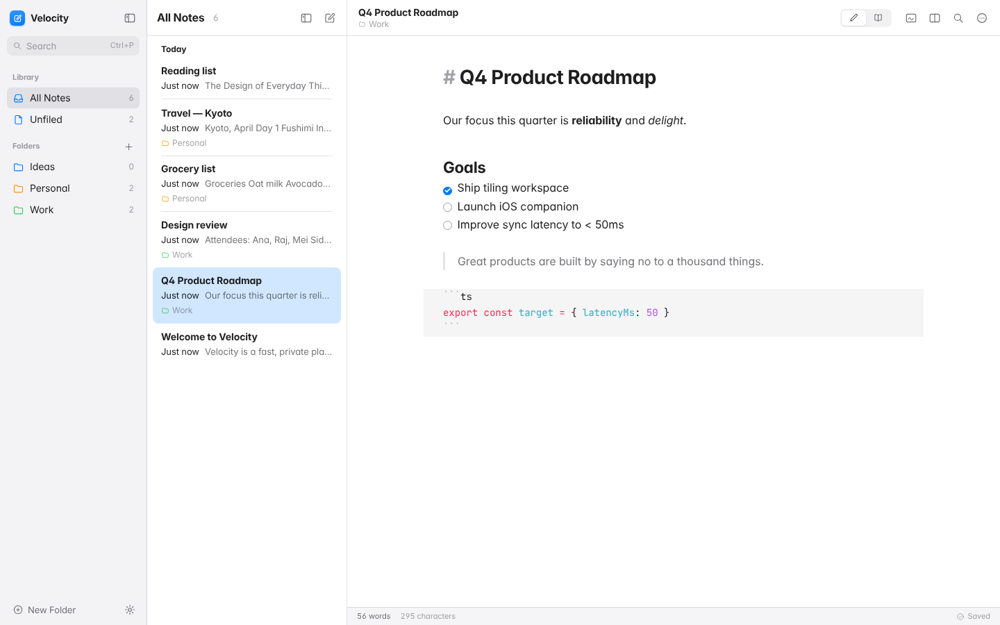
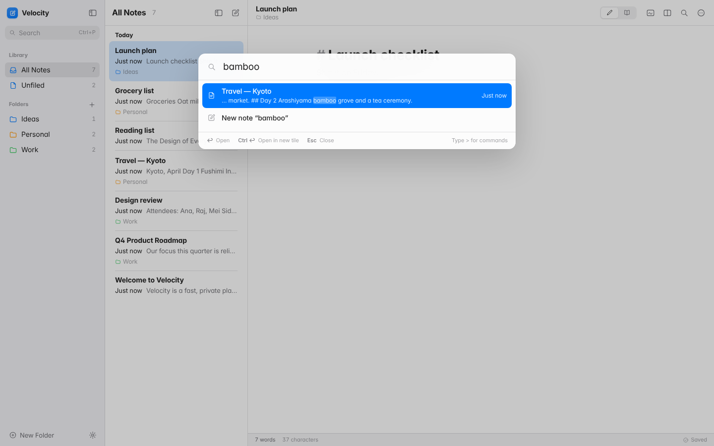
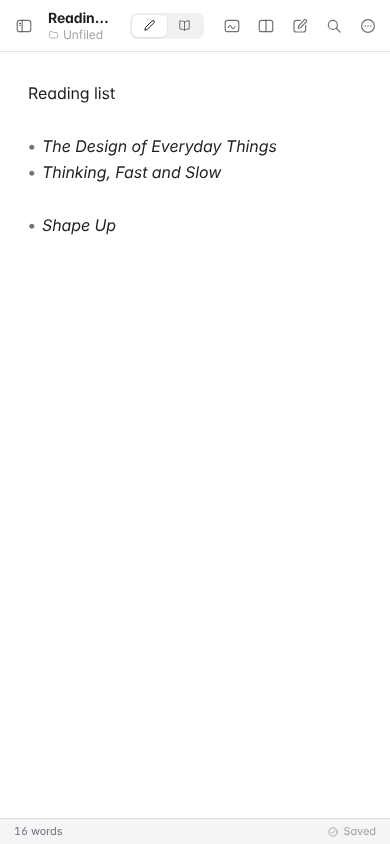

# Velocity UI/UX Revamp: Results

Branch: `feature/apple-hig-ui-revamp`. The plan and the full UX audit are in [PLAN.md](PLAN.md).

## Before and after

| | Before | After |
|---|---|---|
| Main window |  |  |
| Search |  |  |
| Phone |  |  |

Every screenshot in `docs/screenshots/after/` comes from the Playwright suite (`cd client && npm run test:e2e`) and is regenerated on each run:

| # | Screen | # | Screen |
|---|---|---|---|
| 01 | First-run welcome note | 14 | Drag a note onto a tile edge |
| 02 | Folder filter | 15 | Whiteboard as a tile |
| 03 | Library, light | 16 | Read mode |
| 04 | New note autosaved | 17 | Delete alert (HIG) |
| 05 | Inline rename (F2) | 18 | Offline indicator |
| 06 | Palette: full-text search | 19 | Settings sheet |
| 07 | Palette: commands (`>`) | 20 | Orange accent + serif font |
| 08 | Dark mode | 21 | Keyboard shortcuts sheet |
| 09 | Empty tile launcher | 22 | Sidebar hidden |
| 10 | Three tiles, dwindle layout | 23 | Dark, tiled, with whiteboard |
| 11 | Zoomed tile | 24 | Phone: editor |
| 12 | Rotated split | 25 | Phone: sidebar sheet |
| 13 | Layout restored after reload | | |

## Performance

Input-to-next-frame latency was measured while typing 120 characters, using headless Chromium on the same machine and the same API server. "Before" is `main`.

| Note | Build | Median | p95 | Long tasks (>50 ms) |
|---|---|---|---|---|
| Large (4,000 lines, ~220 KB) | before | 77 ms | 94 ms | **120 / 120 keystrokes** |
| Large (4,000 lines, ~220 KB) | after | **36 ms** | **48 ms** | **2** |
| Small (grocery list) | before | 17 ms | 21 ms | 0 |
| Small (grocery list) | after | 17 ms | 21 ms | 0 |

What changed:

* **Live-preview image field.** It used to force a full parse (with a 5 s budget) and regex-scan every line on *every keystroke*. It now rebuilds only when an edit or the cursor touches a line with image syntax. Otherwise it maps positions.
* **Editor and React.** CodeMirror owns its document. Keystrokes flow out to the store, and only external changes flow back in through a subscription, so typing never re-renders the editor's React tree.
* **Shell subscriptions.** The old `App` subscribed to the whole store, so the sidebar, tabs and toolbar all re-rendered on every keystroke. Each component now selects only what it shows. The notes list follows a throttled (300 ms), deferred view of the data and caches title and preview text per note object.
* **Search indexing.** FlexSearch re-tokenising moved off the keystroke path (250 ms idle debounce). Startup no longer re-indexes cached documents.
* **Bundle.** Tailwind was removed. CodeMirror has its own cacheable chunk, and Excalidraw stays lazy-loaded.

## Workers

### Auto-save (client): `client/src/lib/syncEngine.ts`

| Behaviour | Before | After |
|---|---|---|
| Close a tab within 800 ms of typing | **edit lost** (timer cancelled) | flushed immediately |
| Reload or close the browser mid-debounce | edit lost | `pagehide` keepalive flush, plus a flush when the page is hidden |
| Continuous typing | never saved until a pause | max-wait checkpoint every 5 s |
| Edit during an in-flight save | dirty flag cleared too early | revisions: only the latest revision clears "dirty" |
| Concurrent saves of one note | possible | one in flight, the rest coalesced into one follow-up |
| Payload | full title + content + group on every save | changed fields only |
| After 3 failures | silently gave up | "Offline" status, then retried on `online`, focus, or ⌘S |

### File sync (server): `server/workers/markdownSync.ts`

| Behaviour | Before | After |
|---|---|---|
| Trigger | poll every 5 s | write-triggered (750 ms debounce), plus a 60 s safety poll |
| Work per pass | read **all** content and **all** files | metadata scan; content loaded only for changed notes; compared by hash |
| Rename | stale `id - Old.md` left behind | old file removed |
| Delete | file left forever | file and exported assets removed. Orphans are cleaned on start |
| Images | `/api/assets/:id` links (broken offline) | copied next to the Markdown with relative links |
| Writes | direct | atomic (temp file + rename) |

The API also stopped echoing the note body in `PUT` responses, and note routes are gzip-compressed.

## Tests

| Suite | Command | Count |
|---|---|---|
| Client unit (Vitest) | `cd client && npm test` | 40 |
| Server API + worker (`node:test`) | `cd server && npm test` | 10 |
| End-to-end (Playwright, headless Chromium) | `cd client && npm run test:e2e` | 22 |

The E2E suite runs against a throwaway database. It covers:

* onboarding, autosave, flush-on-close, rename and folders
* the palette and every tiling operation
* layout restore, drag-to-tile, the whiteboard tile and read mode
* formatting keys, the delete alert, offline recovery, settings and the phone layout
* a large-note typing budget

## Follow-ups worth considering

* Store whiteboards in SQLite. They are still per-browser `localStorage`, as before.
* Pinned notes and a "Recently Deleted" folder. Both need a small schema change.
* Verify multi-cursor by hand (CodeMirror native). It is still unchecked in the CLAUDE.md checklist.
* User-rebindable shortcuts. The command registry already makes this a small change.
